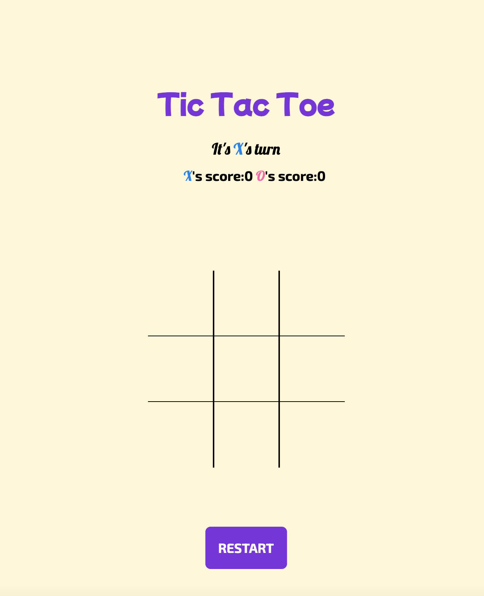
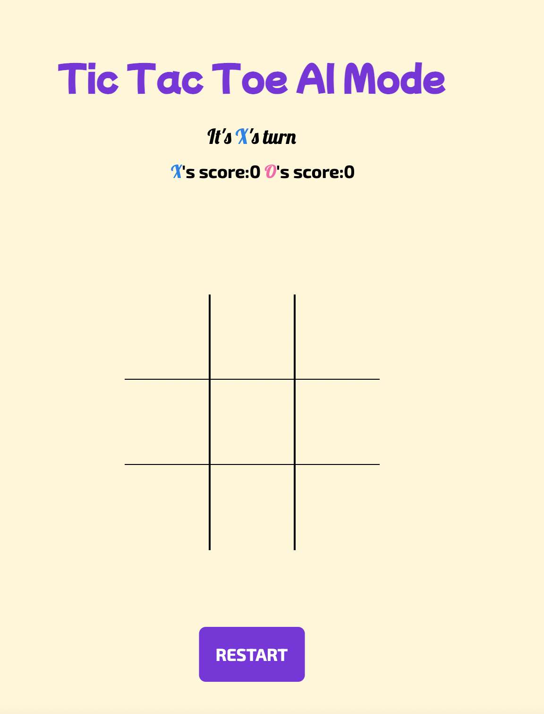
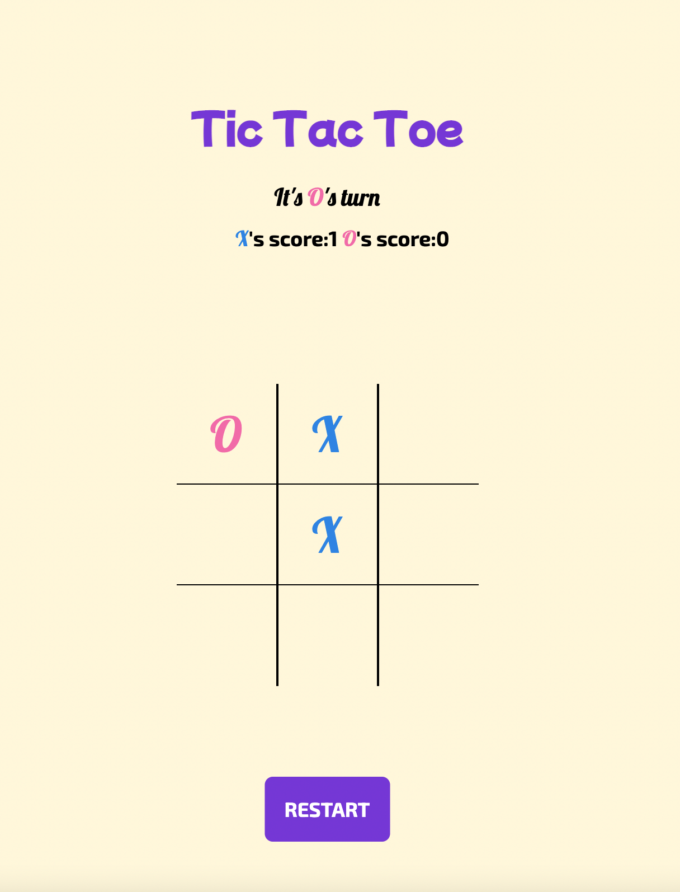
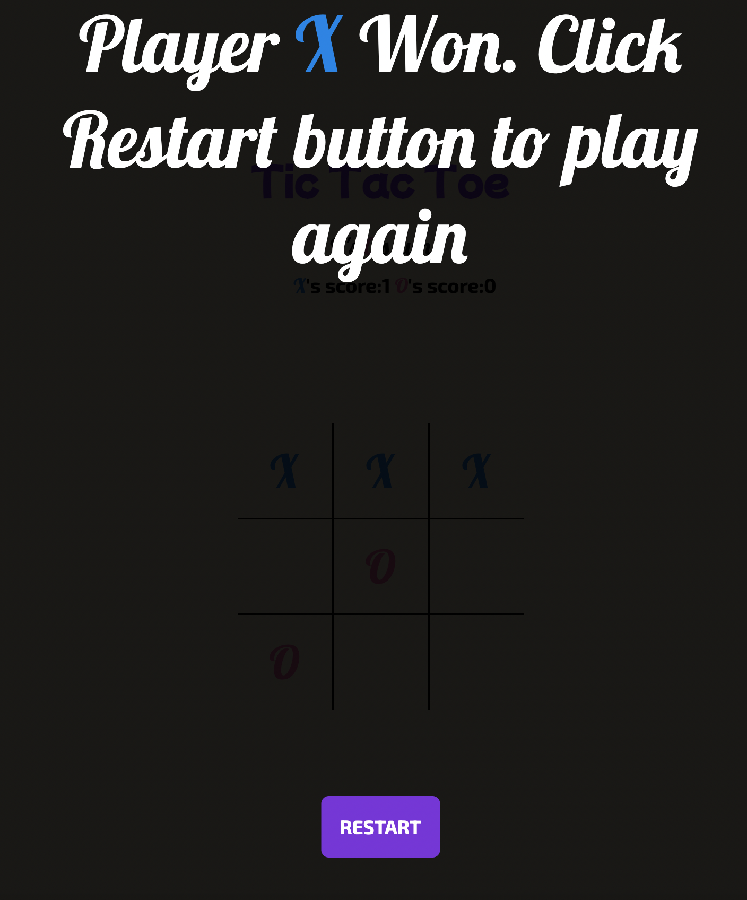

# Tic Tac Toe 
## A simple web game simulator by Alex Zhang

This simulator allows you to play a very simple game, Tic-Tac-Toe

- You can play with yourself 🤡
- You can play with the computer🤖
- You can play this game by clicking [here]👈

## Features

- By clicking the title "Tic Tac Toe", it will change to an AI mode, click the title again, it will go back to the original mode.
- You can restart at anytime, if you would like to restart the game in the middle, the restart button still works.
- It counts the wins of each player. (X and O)
- It shows a winning page that telling you who's the winner of the game. 
- You can only click each cell on the board once, if you try to re-click it, your cursor will change. 
- You cannot click the grid if the winning page shows up. 
- If you would like to start a new match, just simply refresh your browser. 

## Tech

This project uses the following techs :

- [HTML] - the structure of the program.
- [CSS] - styling the web page
- [JavaScript] - providing the interaction between the user and the computer
- [jQuery] - this project uses the jQuery library rather than Vanilla JS.

## Preview

This is the homepage, X is always the first player to go, you can click any grid on the board

This is the AI mode page, you can entre this mode by clicking "Tic Tac Toe", if you click the title again, it will go back to original mode

This is a playing page, you can also click the RESTART button to restart the game any time, it does not affect your score

This is a winning page, it tells you who the winner is or if the game is a tie. you cannot click any cell on the board now, you need to restart a new game by clicking the restart button
## Wishlist
- Customize each player's name, and allow user to pick "X" and "O".
- The AI mode has not been implemented successfully. This will a TODO task. 
- Re-style the page to make it prettier. 
- Add some sound effect.

   [here]:https://karmalexz.github.io/tic-tac-toe/
